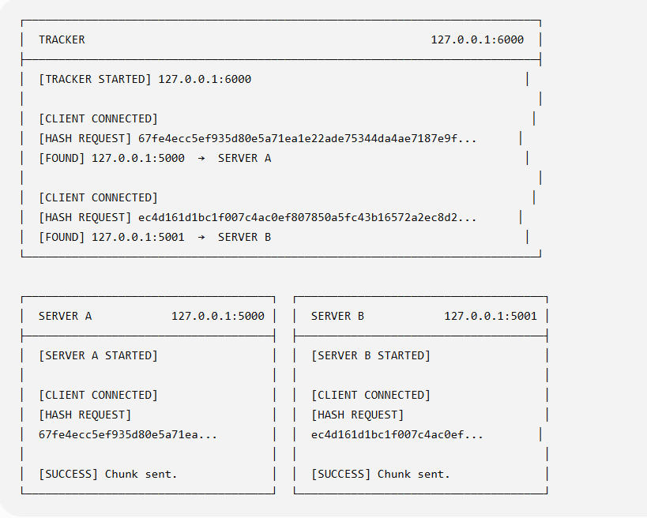
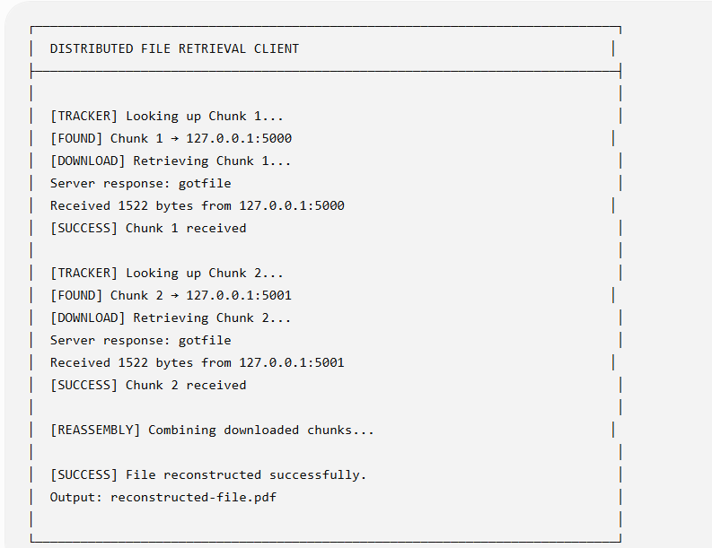
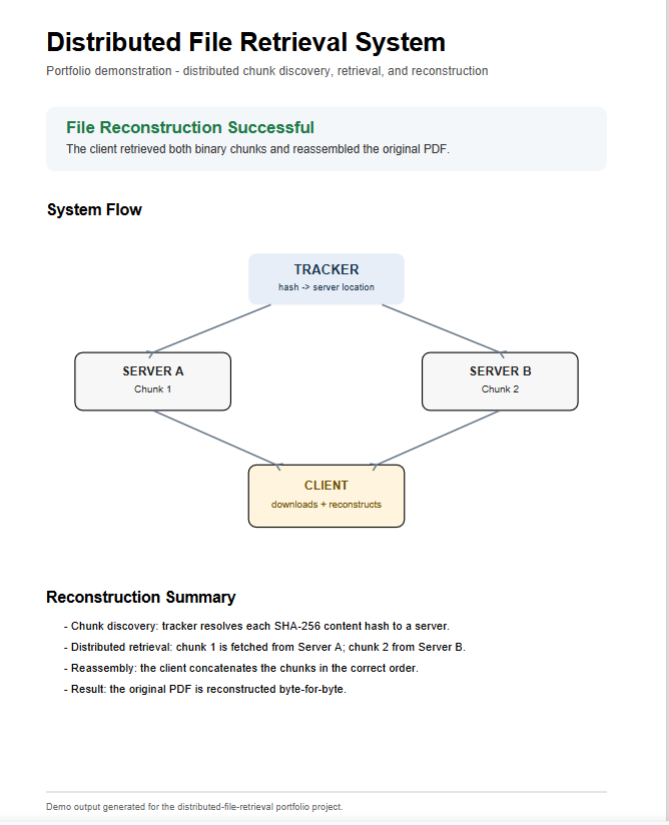

# 🌐 Distributed File Retrieval System

A Python-based **distributed file retrieval system** that demonstrates how a client can discover, retrieve, and reconstruct file chunks stored across multiple servers.

The system uses a central **tracker** to map SHA-256 content hashes to server locations. The client queries the tracker, retrieves each chunk from the appropriate server, and combines the downloaded binary data to reconstruct the original file.

---

## 📸 Demo

### 1. Distributed Chunk Discovery & Transfer



The tracker resolves each requested SHA-256 hash to the server storing that chunk. Server A and Server B then independently serve their respective pieces of the file.

### 2. Client Retrieval & Reconstruction



The client discovers both chunk locations, downloads each **1,522-byte chunk** from separate servers, and combines them in the correct order.

### 3. Reconstructed Output



The resulting PDF is successfully reconstructed from the two independently retrieved binary chunks.

---

## ✨ Features

* 🌐 Distributed client-server architecture
* 🔎 Tracker-based chunk discovery
* #️⃣ SHA-256 content-based chunk identification
* 🖥️ Multiple independent file servers
* 📡 TCP socket communication
* 📦 Binary file transfer over the network
* 🧩 Multi-chunk file reconstruction
* 📍 Dynamic server lookup through the tracker
* 🐍 Built entirely with Python's standard library

---

## 🏗️ Architecture

The system consists of four components:

```text
                         ┌───────────────────┐
                         │      TRACKER      │
                         │   127.0.0.1:6000  │
                         │                   │
                         │ SHA-256 → Server  │
                         └─────────┬─────────┘
                                   │
                         Chunk location lookup
                                   │
                                   ▼
                         ┌───────────────────┐
                         │      CLIENT       │
                         │                   │
                         │ Discover          │
                         │ Download          │
                         │ Reconstruct       │
                         └──────┬─────┬──────┘
                                │     │
                 Download       │     │       Download
                  Chunk 1       │     │        Chunk 2
                                │     │
                    ┌───────────┘     └───────────┐
                    ▼                             ▼
           ┌─────────────────┐           ┌─────────────────┐
           │    SERVER A     │           │    SERVER B     │
           │ 127.0.0.1:5000  │           │ 127.0.0.1:5001  │
           │                 │           │                 │
           │     Chunk 1     │           │     Chunk 2     │
           └─────────────────┘           └─────────────────┘
```

The tracker does not transfer the actual file data. Its job is to tell the client **where each requested chunk is located**.

The client then connects directly to the corresponding servers to retrieve the binary chunks.

---

## 🔄 How It Works

### 1. Server Indexing

When Server A and Server B start, each server scans its local `files` directory.

The server calculates a **SHA-256 hash** for every available file chunk and stores a mapping between the hash and its local file path.

```text
SHA-256 Hash → Local Chunk
```

This allows chunks to be requested by their content hash instead of only by filename.

### 2. Tracker Lookup

The client knows the SHA-256 hashes of the chunks required to reconstruct the file.

For each chunk, it sends the hash to the tracker:

```text
Client → Tracker

"Where is this SHA-256 hash stored?"
```

The tracker looks up the hash and responds with the appropriate server address:

```text
Chunk 1 → 127.0.0.1:5000
Chunk 2 → 127.0.0.1:5001
```

### 3. Distributed Download

After receiving the server location, the client connects directly to that server and requests the chunk using its SHA-256 hash.

In the current demo:

```text
Server A → distributed-demo.part1.bin
Server B → distributed-demo.part2.bin
```

Each chunk contains **1,522 bytes** of the original PDF.

### 4. File Reconstruction

After both chunks are downloaded, the client combines them in their original order:

```text
Chunk 1 + Chunk 2
        ↓
reconstructed-file.pdf
```

The resulting file is a valid reconstruction of the original PDF.

---

## 🛠️ Technologies

| Technology      | Purpose                                               |
| --------------- | ----------------------------------------------------- |
| **Python**      | Core application logic                                |
| **TCP Sockets** | Communication between distributed components          |
| **SHA-256**     | Content-based chunk identification                    |
| **Hashlib**     | Generating SHA-256 hashes                             |
| **Binary I/O**  | Reading, transferring, and reconstructing file chunks |
| **TCP/IP**      | Client, tracker, and server communication             |

The project uses only Python's standard library and requires no external packages.

---

## 📁 Project Structure

```text
distributed-file-retrieval/
│
├── client.py
├── tracker.py
├── .gitignore
├── README.md
│
├── serverA/
│   ├── server.py
│   └── files/
│       └── distributed-demo.part1.bin
│
├── serverB/
│   ├── server.py
│   └── files/
│       └── distributed-demo.part2.bin
│
└── screenshots/
    ├── system-running.png
    ├── client-retrieval.png
    └── reconstructed-file.png
```

`reconstructed-file.pdf` is generated when the client successfully retrieves both chunks and is excluded from Git using `.gitignore`.

---

## 🚀 Getting Started

### 1. Clone the Repository

```bash
git clone https://github.com/iamprashik/distributed-file-retrieval.git
```

Navigate into the project:

```bash
cd distributed-file-retrieval
```

No additional dependencies need to be installed.

---

### 2. Start the Tracker

Open the first terminal:

```bash
python tracker.py
```

The tracker should start on:

```text
127.0.0.1:6000
```

---

### 3. Start Server A

Open a second terminal:

```bash
python serverA/server.py
```

Server A runs on:

```text
127.0.0.1:5000
```

and stores the first file chunk.

---

### 4. Start Server B

Open a third terminal:

```bash
python serverB/server.py
```

Server B runs on:

```text
127.0.0.1:5001
```

and stores the second file chunk.

---

### 5. Run the Client

Open a fourth terminal:

```bash
python client.py
```

The client will:

1. Ask the tracker for Chunk 1's location
2. Download Chunk 1 from Server A
3. Ask the tracker for Chunk 2's location
4. Download Chunk 2 from Server B
5. Combine both binary chunks
6. Generate `reconstructed-file.pdf`

A successful run ends with:

```text
[REASSEMBLY] Combining downloaded chunks...

[SUCCESS] File reconstructed successfully.
Output: reconstructed-file.pdf
```

---

## 🧠 What I Learned

Building this project helped me gain practical experience with:

* Distributed system architecture
* TCP socket programming
* Client-server communication
* Designing a tracker-based discovery mechanism
* SHA-256 hashing
* Content-based file identification
* Binary data transmission
* Working with multiple network services
* File chunking and reconstruction
* Coordinating communication between distributed components

It also helped demonstrate the separation between **resource discovery** and **resource transfer**: the tracker locates the data, while the file servers deliver it directly to the client.

---

## 🔮 Future Improvements

* Dynamically register servers and chunks with the tracker
* Verify downloaded chunks against their SHA-256 hashes on the client
* Support files containing any number of chunks
* Download chunks concurrently from multiple servers
* Add automatic file splitting
* Add server failure handling and retry logic
* Replicate chunks across multiple servers for fault tolerance
* Support multiple simultaneous clients
* Replace hard-coded network configuration with configuration files
* Add a graphical or web-based interface

---

## 👨‍💻 Author

**Prashik Koirala**

[LinkedIn](https://www.linkedin.com/in/prashik-koirala-b6a64b3b0/) • [GitHub](https://github.com/iamprashik) • [Email](mailto:iamprashikkoirala@gmail.com)
